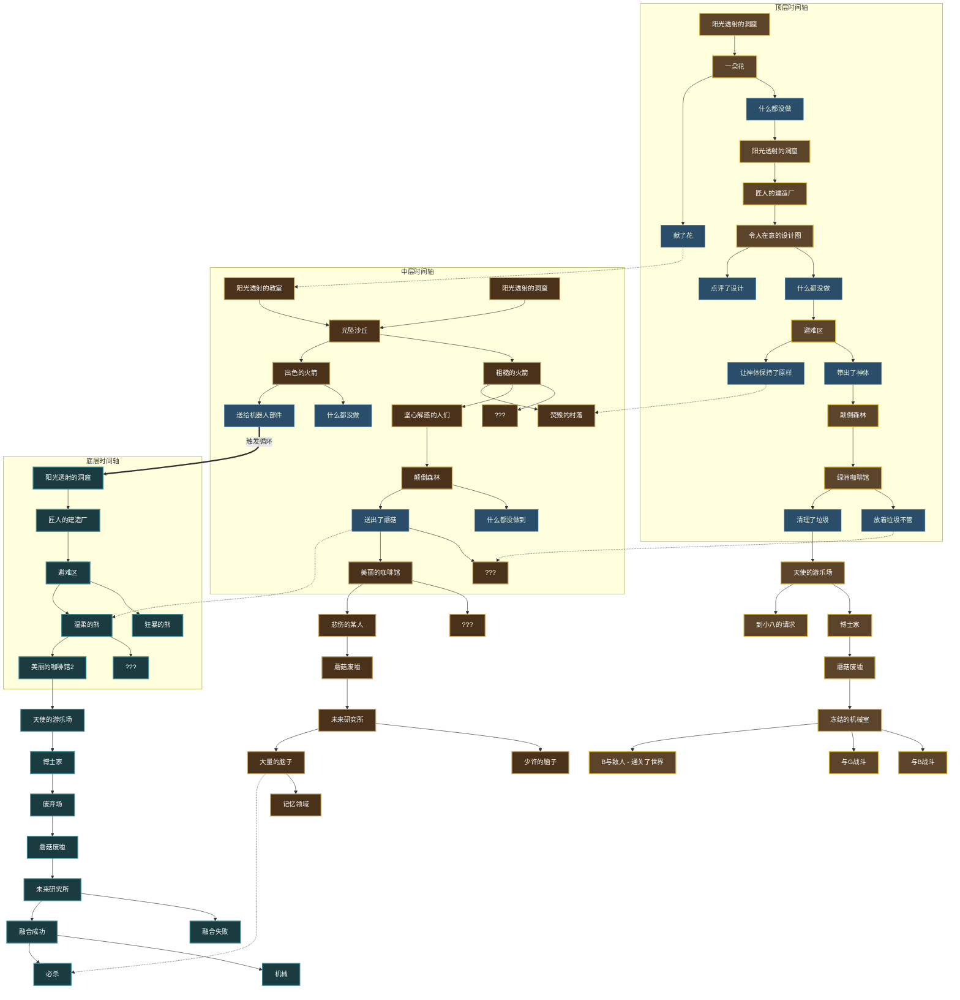

```mermaid
flowchart TD
    %% 样式定义
    classDef topLayer fill:#5c442a,stroke:#d4af37,stroke-width:2px,color:#fff;
    classDef midLayer fill:#4a321a,stroke:#c0a060,stroke-width:2px,color:#fff;
    classDef botLayer fill:#1a3c40,stroke:#3a8b94,stroke-width:2px,color:#fff;
    classDef branch fill:#2a4d69,stroke:#4b86b4,stroke-width:1px,color:#edf5e1;
    classDef special fill:#800000,stroke:#ff0000,stroke-width:1px,color:#fff;
    classDef yellowLine stroke:#ffff00,stroke-width:2px;

    %% --- 顶层时间轴 (第一阶段) ---
    subgraph T_L [顶层时间轴]
        T1[阳光透射的洞窟] --> T2[一朵花]
        T2 --> T2_B1[什么都没做]
        T2 --> T2_B2[献了花]
        T2_B1 --> T3[阳光透射的洞窟]
        T3 --> T4[匠人的建造厂]
        T4 --> T5[令人在意的设计图]
        T5 --> T5_B1[什么都没做]
        T5 --> T5_B2[点评了设计]
        T5_B1 --> T6[避难区]
        T6 --> T6_B1[带出了神体]
        T6 --> T6_B2[让神体保持了原样]
        T6_B1 --> T7[颠倒森林]
        T7 --> T8[绿洲咖啡馆]
        T8 --> T8_B1[放着垃圾不管]
        T8 --> T8_B2[清理了垃圾]
    end

    %% --- 中层时间轴 (第二阶段) ---
    subgraph M_L [中层时间轴]
        M1_1[阳光透射的教室] --> M2[光坠沙丘]
        M1_2[阳光透射的洞窟] --> M2
        M2 --> M3_1[粗糙的火箭]
        M2 --> M3_2[出色的火箭]
        M3_2 --> M3_B1[什么都没做]
        M3_2 --> M3_B2[送给机器人部件]
        
        M3_1 --> M4_1["???"]
        M3_1 --> M4_2[坚心解惑的人们]
        M3_1 --> M4_3[焚毁的村落]
        
        M4_2 --> M5[颠倒森林]
        M5 --> M5_B1[什么都没做到]
        M5 --> M5_B2[送出了蘑菇]
        M5_B2 --> M6_1["???"]
        M5_B2 --> M6_2[美丽的咖啡馆]
    end

    %% --- 底层时间轴 (第三阶段) ---
    subgraph B_L [底层时间轴]
        B1[阳光透射的洞窟] --> B2[匠人的建造厂]
        B2 --> B3[避难区]
        B3 --> B4_1[狂暴的熊]
        B3 --> B4_2[温柔的熊]
        B4_2 --> B5_1["???"]
        B4_2 --> B5_2[美丽的咖啡馆2]
    end

    %% --- 第一张图与第二张图的延续与跨层连接 ---
    T8_B2 --> T9[天使的游乐场]
    T9 --> T10_1[博士家]
    T9 --> T10_2[到小八的请求]
    T10_1 --> T11[蘑菇废墟]
    T11 --> T12[冻结的机械室]
    T12 --> T13_1[与B战斗]
    T12 --> T13_2[与G战斗]
    T12 --> T13_3[B与敌人 - 通关了世界]

    M6_2 --> M7_1["???"]
    M6_2 --> M7_2[悲伤的某人]
    M7_2 --> M8[蘑菇废墟]
    M8 --> M9[未来研究所]
    M9 --> M10_1[少许的脑子]
    M9 --> M10_2[大量的脑子]
    M10_2 --> M11[记忆领域]

    B5_2 --> B6[天使的游乐场]
    B6 --> B7[博士家]
    B7 --> B8[废弃场]
    B8 --> B9[蘑菇废墟]
    B9 --> B10[未来研究所]
    B10 --> B11_1[融合失败]
    B10 --> B11_2[融合成功]
    B11_2 --> B12_1[机械]
    B11_2 --> B12_2[必杀]

    %% 跨线交互线 (彩色箭头)
    T2_B2 -.-> M1_1
    T6_B2 -.-> M4_3
    M3_B2 == 触发循环 ==> B1
    M10_2 -.-> B12_2
    T8_B1 -.-> M6_1
    M5_B2 -.-> B4_2

    %% 应用样式
    class T1,T2,T3,T4,T5,T6,T7,T8,T9,T10_1,T10_2,T11,T12,T13_1,T13_2,T13_3 topLayer;
    class M1_1,M1_2,M2,M3_1,M3_2,M4_1,M4_2,M4_3,M5,M6_1,M6_2,M7_1,M7_2,M8,M9,M10_1,M10_2,M11 midLayer;
    class B1,B2,B3,B4_1,B4_2,B5_1,B5_2,B6,B7,B8,B9,B10,B11_1,B11_2,B12_1,B12_2 botLayer;
    class T2_B1,T2_B2,T5_B1,T5_B2,T6_B1,T6_B2,T8_B1,T8_B2,M3_B1,M3_B2,M5_B1,M5_B2 branch;
```
